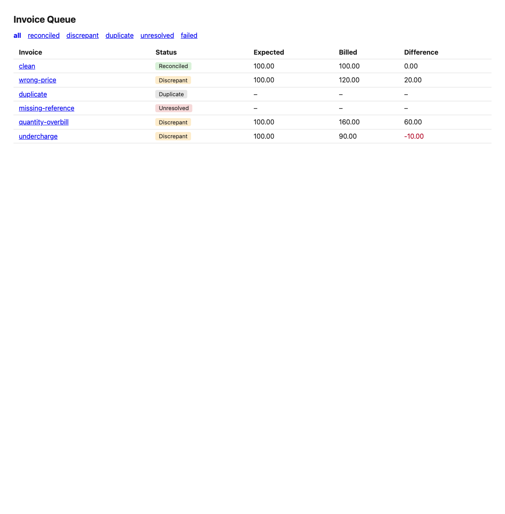
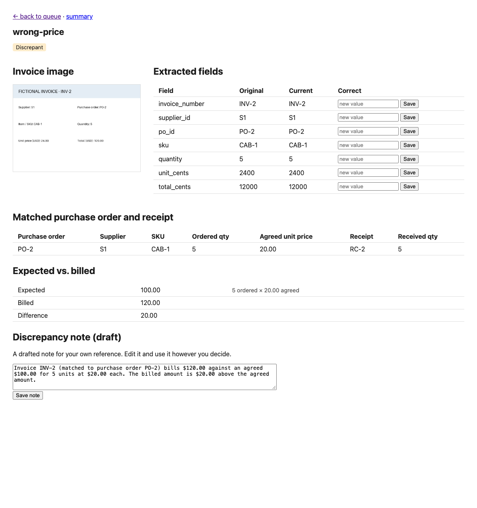
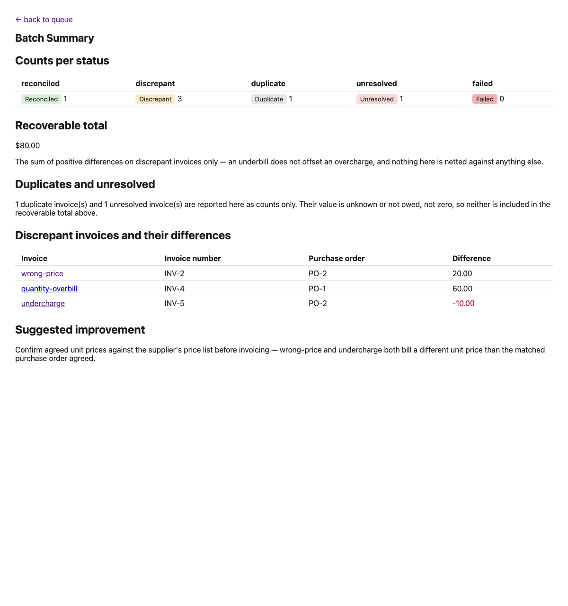

# Invoice Reconciliation and Review

This tool reads invoice images, matches each one against a purchase order and
a receipt, and classifies it as reconciled, discrepant, duplicate, or
unresolved. A reviewer can correct a misread value through a web page, and
the result recalculates on the spot.

One pipeline runs both entry points. The headless batch command (`cli.py`)
and the web view (`web/`) read and write the same database through the same
reconciliation function. Neither is a copy of the other.

Full design detail is in `context/spec/001-invoice-reconciliation-review/`.
This file is the entry point for an assessor: what to run, what to expect,
and what was decided along the way.

### The other documents

| Document | What it is for |
| --- | --- |
| [`docs/walkthrough.md`](docs/walkthrough.md) | Approach and findings, in a few minutes. Start here. |
| [`docs/architecture.md`](docs/architecture.md) | Diagrams: the system, the successful flow, the two failure paths, the data model. Answers where state is stored and which AWS services are used. |
| [`docs/demo-script.md`](docs/demo-script.md) | Step-by-step demo tables, with likely questions and honest answers. |
| [`docs/llm-usage-note.md`](docs/llm-usage-note.md) | Tools and models used, and two worked examples of checking and correcting AI output. |
| [`docs/compliance-audit.md`](docs/compliance-audit.md) | This project audited against the brief, row by row, including what was missing. |
| [`ai-workflow/manifest.json`](ai-workflow/manifest.json) | The AI configuration used, and how to reproduce it. |

---

## Run instructions

### The assessor path — no AWS access needed

```
uv run python -m invoice_reconciliation.cli --reset-db --from-cache --seed-check
```

This rebuilds the database, replays the six invoices from saved Bedrock
responses committed in `tests/fixtures/bedrock_responses/`, reconciles each
one, and checks the result against the hand-calculated answers in
`tasks/invoices/expected-seed-results.json`. No network call happens. Run
with the AWS credential chain fully disabled, the command still works:

```
$ AWS_PROFILE=nope AWS_EC2_METADATA_DISABLED=true AWS_CONFIG_FILE=/dev/null AWS_SHARED_CREDENTIALS_FILE=/dev/null \
  uv run python -m invoice_reconciliation.cli --reset-db --from-cache --seed-check

Processed 6 invoice(s):
  [clean] status=reconciled expected=$100.00 billed=$100.00 difference=$0.00
  [wrong-price] status=discrepant expected=$100.00 billed=$120.00 difference=$20.00
  [duplicate] status=duplicate expected=- billed=- difference=- count_as_payable=False
  [missing-reference] status=unresolved expected=- billed=- difference=-
  [quantity-overbill] status=discrepant expected=$100.00 billed=$160.00 difference=$60.00
  [undercharge] status=discrepant expected=$100.00 billed=$90.00 difference=-$10.00
Processing: all invoices processed (no 'failed' status).

Seed check results:
  [PASS] clean: OK (reconciled)
  [PASS] wrong-price: OK (discrepant)
  [PASS] duplicate: OK (duplicate)
  [PASS] missing-reference: OK (unresolved)
Seed comparison: PASSED — all cases match the oracle exactly.
```

Exit code `0`.

### Live extraction (needs AWS credentials)

```
uv run python -m invoice_reconciliation.cli --extract --reset-db --seed-check
```

This reads each invoice image through a live Bedrock call instead of the
saved responses. It needs a valid AWS session with Bedrock access in
`us-east-1`. Two commands produce that session:

- `aws login` — the in-house wrapper used on this machine.
- `aws configure sso` once, then `aws sso login --profile <name>` — the
  standard AWS CLI path. An external assessor will not have the in-house
  wrapper, so this is the one to use.

If the session lands under a named profile rather than `default`, set
`export AWS_PROFILE=<name>` first. Without it, the credential chain resolves
`default` and every invoice fails.

**A model or API failure never stops the batch.** A missing credential,
throttling (`ThrottlingException`), an access error from Bedrock, a
timeout, or a response that cannot be read fails only the invoice
concerned. That invoice is saved as `failed`, with the reason, and the
batch continues. The reason shows in the CLI report, on the queue's
`failed` filter and on the invoice's detail page. With no credentials at
all, every invoice is `failed` with `NoCredentialsError` in its reason,
and the CLI exits with code 2, not a traceback.
`extraction/client.py` turns every such error into one `ModelCallError`;
`db/ingest.py` catches it for each invoice. Tests simulate each case with a
fake Bedrock client (`tests/unit/test_extraction_ingest.py`).

To force fresh live calls and overwrite the saved responses, add
`--refresh-cache` in place of `--from-cache`. `--from-cache` and
`--refresh-cache` are mutually exclusive.

### All CLI flags

```
uv run python -m invoice_reconciliation.cli --help
```

| Flag | Purpose |
| --- | --- |
| `--extract` | Read each invoice through a live Bedrock call. Needs AWS credentials. Off by default. |
| `--from-cache` | Run extraction from saved responses. No credentials needed. |
| `--refresh-cache` | Force live calls and overwrite the saved responses. |
| `--seed-check` | After persisting, compare results with `expected-seed-results.json`. |
| `--reset-db` | Drop and rebuild the database before ingest. |
| `--ingest-dir PATH` | Source directory. Default `tasks/invoices/`. |
| `--db-path PATH` | Database location. Default `invoice_reconciliation.sqlite`. |
| `--log-level` | Logging verbosity. Default `WARNING`. |

Exit codes separate two different problems — "the model failed" and "the
rules are wrong" — rather than merging them into one number:

| Code | Meaning |
| --- | --- |
| 0 | Success. No invoice failed, and the seed check (if requested) passed. |
| 1 | Seed check failed, but no invoice failed to process. A rules/data problem. |
| 2 | One or more invoices failed to process, or the batch crashed before finishing. A processing problem. |
| 3 | Both: at least one invoice failed to process, and the seed check (if requested) also failed. |

### The web view

Run the batch command once first, with no `--db-path` override, so it
writes to the default `invoice_reconciliation.sqlite` in the repository
root:

```
uv run python -m invoice_reconciliation.cli --reset-db --from-cache
```

Then start the server:

```
uv run uvicorn invoice_reconciliation.web.app:create_app --factory
```

Open `http://127.0.0.1:8000/invoices`. Three screens:

- **`/invoices`** — the queue. Every invoice with its status, expected
  amount, billed amount, and difference. Links to filter by status.
- **`/invoices/{id}`** — the detail page for one invoice: the image, the
  seven extracted fields (original value beside current value, with a
  correction form for each), the matched purchase order and receipt, the
  expected-versus-billed calculation, and a draft discrepancy note.
  Saving a correction recalculates the result in place and redirects back
  to this page.
- **`/summary`** — counts per status, the recoverable total, each
  discrepant invoice's difference, and one suggested process improvement.

Screenshots from a real run, against the six seeded invoices:

| Queue | Detail | Summary |
| --- | --- | --- |
|  |  |  |

### Tests

```
uv run pytest -q
```

159 tests pass.

---

## The five required checks

Run against the six seeded invoices, with the AWS credential chain fully
disabled (`AWS_PROFILE=nope AWS_EC2_METADATA_DISABLED=true
AWS_CONFIG_FILE=/dev/null AWS_SHARED_CREDENTIALS_FILE=/dev/null`), so the
result cannot depend on network access.

| # | Check | Expected | Observed | Result |
| --- | --- | --- | --- | --- |
| 1 | Clean invoice reconciles | status `reconciled`, difference $0.00 | `status=reconciled expected=$100.00 billed=$100.00 difference=$0.00` | PASS |
| 2 | Wrong price flags as discrepant | status `discrepant`, difference $20.00 | `status=discrepant expected=$100.00 billed=$120.00 difference=$20.00` | PASS |
| 3 | Duplicate invoice excluded from payable total | status `duplicate`, `count_as_payable=false` | `status=duplicate expected=- billed=- difference=- count_as_payable=False` | PASS |
| 4 | Missing reference stays unresolved, no invented match | status `unresolved`, no matched purchase order or receipt | `status=unresolved expected=- billed=- difference=-`; `matched_po_id=(none)` `matched_receipt_id=(none)` | PASS |
| 5 | A correction survives a restart | the corrected result is still there after a new process opens the database | see below | PASS |

**All five checks pass.**

Check 5, run across two separate processes — a correction made in one
server process, then read back from a brand-new one with no shared memory:

```
before: ('discrepant', 2000)
POST /invoices/2/fields/total_cents  -> 303 See Other

[server process stopped, a new one started against the same database file]

after (new process): ('reconciled', 0)
original_value / current_value for total_cents: ('12000', '10000')
corrections rows for this invoice: 1
```

`original_value` stays `12000` — the value extraction first produced is
never overwritten. `current_value` moved to `10000`, the corrected amount.
One row was appended to `corrections` recording the change. The new
process read the corrected, reconciled result straight from disk, with no
server-side state carried over.

---

## Time spent

About five and a quarter hours of committed work, against the brief's
eight-hour budget. The first commit is timestamped 17:25 and the last
22:39 on 6 October 2026, across 15 commits. That span covers the planning
documents, the build, the tests, and the submission documents. It does not
count reading the brief and the starter pack beforehand.

## The suggested process improvements

The `/summary` page builds its improvements from the saved results each
time it loads. One discrepancy is a case for a reviewer, not a process
problem, so the page looks for issue types that occur across invoices.

1. **Code counts every issue type in the database.**

   | Issue type | Where it comes from | Conclusion (chosen by code) |
   |---|---|---|
   | Unit price differs | discrepant, source unit price | Recheck unit prices against the purchase order before shipping. |
   | Quantity differs | discrepant, source quantity | Recheck quantities against the purchase order before shipping. |
   | Unit price and quantity differ | discrepant, both | Recheck unit prices and quantities against the purchase order before shipping. |
   | Total differs | discrepant, total only | Recheck invoice totals against the purchase order before shipping. |
   | Duplicate invoice | status `duplicate` | Check each invoice number against invoices already received before approval. |
   | Missing purchase-order reference | status `unresolved` | Ask for a purchase-order reference on every invoice. |
   | Invoice could not be read | status `failed` | Check the scan quality of each invoice when it arrives. |

2. **Code ranks them and keeps the top two.** An issue is *recurring*
   only when 2 or more invoices have it. A count of 1 is labelled
   "Single case", and when no issue recurs the page says "No issue recurs
   yet". On a tie, the order of the table above decides.
3. **One model call writes one plain sentence per issue** on which
   invoices have it (`reconciliation/improvement.py`, prompt in
   `prompts.build_improvement_prompt`). It gets no dollar figure. It must
   end with the conclusion from the table, word for word.
   `verify_improvement` rejects a draft that leaves out the conclusion,
   uses blame words, writes a dollar figure, leaves out an invoice, names
   another invoice, does not describe the issue, or calls a single case
   recurring. Each text is checked on its own. A retry call asks again
   only for the rejected issues, with the reason, up to three calls in
   all; a text that passed is kept. After that, or with no model access, the page uses a prepared
   sentence and labels it. The blame-word check keeps the brief's rule:
   "do not treat a discrepancy as proof of wrongdoing."
4. **With no issue at all,** the page says "No issues in this batch, so no
   improvement is suggested."

The issue types, the rule of 2 or more, the top two and the tie order are
presentation choices, not domain rules: they change no status and no
amount.

For the fresh batch, a live model run gave:

> **Unit price differs · Recurring, 2 invoices.** Invoices wrong-price and
> undercharge bill a unit price that differs from the purchase order.
> Recheck unit prices against the purchase order before shipping.
>
> **Quantity differs · Single case, 1 invoice.** Invoice quantity-overbill
> bills a quantity that differs from the quantity ordered or received.
> Recheck quantities against the purchase order before shipping.

The web app keeps the drafts for each set of issues, so it calls the model
again only when the issues change, for example after a correction. With
more issue types in future, the page still makes one call.

---

## The rounding rule

The platform stores every money value as a whole integer number of USD
cents. `money.dollars_to_cents` is the one function that converts a dollar
amount to cents, and every other module calls it rather than doing its own
arithmetic. All later arithmetic — the expected amount, the billed amount,
the difference, the recoverable total — works on integers only. No step
divides cents by 100 and no step multiplies a float by 100. The platform
converts each amount to cents exactly once, at the boundary where it enters
the system, and never rounds again after that.

The model sometimes returns a money field as a JSON number instead of a
string — measured at about one call in three. `dollars_to_cents` accepts
`str | float | int` for this reason. A numeric input is first formatted as
text with `f"{v:.2f}"`, then split on the decimal point, with each half
parsed as an integer. `float(x) * 100` is never applied to a string — that
is the single most likely silent failure in a project like this, because it
can move a result by a cent without raising anything. The two cases are
tested side by side: `dollars_to_cents("24.00")` and `dollars_to_cents(24.0)`
both return `2400`; `dollars_to_cents("120.00")` and `dollars_to_cents(120.0)`
both return `12000`; `dollars_to_cents(5)` returns `500`.

---

## Settled ambiguities

Eleven gaps in the brief or the supplied data came up during the build. Each
one is recorded here with the gap, the behaviour chosen, and the reason —
not resolved silently.

### 1. Undercharge (a negative difference)

**Gap.** The rules name a positive difference an overcharge, and say
nothing about a negative one.

**Chosen.** Status `discrepant`, difference negative. Excluded from the
recoverable total.

**Reason.** The difference is real and worth showing to a reviewer. It is
not money the business can pursue, so it stays out of the recoverable
figure.

### 2. Quantity mismatch

**Gap.** The rules call for comparing billed quantity against ordered and
received quantity, but every supplied invoice carries quantity 5
throughout. The rule had nothing to test it against.

**Chosen.** A quantity mismatch forces `discrepant`, valued at the agreed
unit price. A new fixture (`quantity-overbill`) was added so the rule has
a case to run against.

**Reason.** The functional specification settles the reading. Leaving the
rule untested would have meant shipping untested logic.

### 3. The recoverable total

**Chosen.** The sum of positive differences on `discrepant` invoices only —
$80.00 for this batch. Duplicates and unresolved invoices are reported as
counts, not folded into any dollar figure.

**Reason.** Summing all discrepant differences, positive and negative,
gives $70.00 for this batch, because the undercharge partly cancels a real
overcharge. That number understates what the business can actually
recover. Duplicates and unresolved invoices have a value that is either not
owed or not known, which is a different kind of "not counted" than zero.

### 4. Failed versus unresolved

**Gap.** `unresolved` means the invoice was read successfully but carries
no purchase-order reference. `failed` means the invoice could not be
processed. These were initially conflated: a failed extraction wrote no
fields, and the matcher read the absence of a `po_id` as "unresolved", not
"failed".

**Chosen.** A failed extraction now records `extraction_failed` and a
reason, and is classified `failed`, not `unresolved`.

**Reason.** The two cases call for different reviewer action. "No
purchase-order reference was printed on this invoice" is a fact about the
document. "The model could not read this invoice at all" is a fact about
the pipeline. Folding one into the other hid the second from a reviewer.

### 5. Which field a correction must change

**Gap.** Correcting an invoice's `unit_cents` has no visible effect,
which could look like a bug.

**Chosen.** Left as documented behaviour, not changed.

**Reason.** `rules.py` reads `billed_cents` from the invoice's own
`total_cents` field, and `expected_cents` from the matched purchase
order's unit price — never from the invoice's own `unit_cents`. Correcting
`unit_cents` therefore changes neither side of the comparison, and the
status does not move. `total_cents` is the field that drives the billed
side. `tasks/invoices/expected-correction-case.json` records the
hand-calculated before and after for the one field that does move the
result.

### 6. Duplicate detection

**Chosen.** Duplicates are matched on supplier ID and invoice number,
ordered by `received_at`. The first copy by that order stays payable; any
later copy is `duplicate` with `count_as_payable` false.

**Reason.** The brief calls for identifying duplicates by supplier ID and
invoice number. `received_at` gives a defined order for which copy counts
as the original when more than one invoice shares that pair.

### 7. Open question: is a discrepancy only about the billed total?

**Status: open.** Not decided; recorded here as the brief asks.

**The gap.** The brief defines the discrepancy amount by the total:

> Billed amount minus expected amount is the discrepancy

It names only one separate comparison, for quantity:

> Expected line amount equals ordered quantity times agreed unit price.
> Compare billed quantity with both ordered and received quantity.

So two things make an invoice discrepant today:

- the billed total differs from the expected total, or
- the billed quantity differs from the ordered quantity or from the
  received quantity. A short delivery counts: 5 ordered, 4 received and 5
  billed is discrepant, because the bill does not match what arrived.

The brief does not say whether the invoice's own unit price, or the
agreement between its fields, also counts.

**The case that exposes it.** INV-5 bills 5 units at $18.00 with a total
of $90.00. A reviewer corrects only the total, to $100.00, and leaves the
unit price at $18.00. The billed total now equals the expected $100.00,
so the difference is $0.00 and the invoice shows as `reconciled`. But
the invoice contradicts itself: 5 × $18.00 is $90.00, not $100.00, and
the image says $90.00.

**Current behaviour.** `rules.py` checks only the billed total and the
billed quantity. It never reads the invoice's own unit price. The
literal rule gives `reconciled`.

**Why it matters.** Editing only the total can make any invoice
`reconciled`. That removes the difference from the queue and from the
recoverable total, although the supplier billed something else. The
correction feature exists to fix misread extractions, not to make an
invoice agree with its purchase order. The brief also asks the platform
to handle "unreadable or invalid extraction" and to "Make unresolved
evidence and failed processing visible."

**Options considered.**

- **A.** If billed quantity × billed unit price does not equal the billed
  total, mark the invoice `unresolved`. The extracted values contradict
  each other, so the evidence cannot be trusted. The note names the
  contradiction and asks the reviewer to check the image.
- **B.** Mark it `discrepant` with a $0.00 difference, and state the
  unit-price difference in the note.
- **C.** Keep the literal rule: the total and the quantity only.

**Not adopted yet,** because the brief also says "Do not silently add
domain rules." Option A is the leading candidate. It treats the case as
invalid extraction, which the brief does cover, rather than as a new
pricing rule.

### 8. A purchase order with more than one receipt

**Status: open.** Not decided; recorded here as the brief asks.

**The gap.** The rules match an invoice by its reference:

> Match using supplier ID and purchase-order ID. A missing or conflicting
> reference remains unresolved.

They do not say how to choose a receipt when a purchase order has more
than one. The brief also says to "leave missing or ambiguous references
unresolved rather than selecting the closest-looking record."

**The data.** Each seeded purchase order has exactly one receipt (`PO-1`
→ `RC-1`, `PO-2` → `RC-2`). No case in the batch has two.

**Current behaviour.** `repository.get_receipt_for_po` reads the first
row that SQLite returns for the purchase order. The query has no
`ORDER BY`, so with two receipts the choice is not defined.

**Not changed,** because the brief says "Do not silently add domain
rules." Marking the invoice `unresolved`, or adding the received
quantities together, would each be a new rule.

### 9. A purchase order with no receipt

**Status: open.** Not decided; recorded here as the brief asks.

**The gap.** The rules say:

> Compare billed quantity with both ordered and received quantity.

They do not say what to do when no receipt exists for the matched
purchase order. A missing receipt is not a missing reference: the
reference is the supplier ID and purchase-order ID on the invoice.

**The data.** Every seeded purchase order has a receipt.

**Current behaviour.** `rules.py` compares the billed quantity with the
ordered quantity only. If the amounts and the ordered quantity agree,
the invoice is `reconciled`, and `matched_receipt_id` stays empty.

**Not changed,** for the same reason as ambiguity 8.

### 10. The SKU

**Status: open.** Not decided; recorded here as the brief asks.

**The gap.** The rules say only that "A purchase order records the agreed
SKU, quantity, and unit price." They match on supplier ID and
purchase-order ID, and give no rule that compares the SKU.

**The data.** Every seeded purchase order, receipt and invoice uses SKU
`CAB-1`.

**Current behaviour.** The model extracts the SKU and the parser
validates it, but the matcher and `rules.py` do not compare it with the
purchase order or the receipt. An invoice with a different SKU gets the
same result as one with the agreed SKU.

**Not changed,** because a SKU check would be a new domain rule.

### 11. Trends over time, such as a rising unit price

**Status: not done, by choice.**

**The gap.** The brief asks to "Explain one recurring issue or useful
process improvement supported by the results". A trend, such as a unit
price that rises from invoice to invoice, would be one kind of pattern.

**Why the results cannot support one.**

- `received_at` is not a real date. Ingest makes it from the order of
  `seed.json`.
- Both purchase orders agree the same unit price, $20.00, for one SKU
  from one supplier.
- The billed unit prices are $24.00, $18.00 and $20.00: one above and one
  below the agreed price. That has no direction.
- Core scope is six to eight invoices.

**Chosen.** The page counts how often each issue type occurs (see "The
suggested process improvements") and does not claim a trend. A trend
claim here would be a finding the data does not show.

---

## Six defects found during the build

Each of these was caught by a test or a check, not by reading the code
afterward. They are listed because they show what the test suite actually
exercised.

1. **`receipts.receipt_id` was typed `INTEGER` against text fixture values**
   such as `"RC-1"`. Ingest crashed with `datatype mismatch`. Two further
   columns in the same table carried the same class of error:
   `matched_receipt_id` had the same wrong type, and `count_as_payable` was
   `NOT NULL` when it must be null for every status except `duplicate`.
2. **A second CLI run without `--reset-db` failed on a foreign-key
   constraint.** Ingest needed to either refuse a second run cleanly or
   require `--reset-db` — the second run without it is not a supported
   path.
3. **Malformed stored money crashed the whole batch instead of failing one
   invoice.** Fixed so `MoneyFormatError` is caught per invoice, in
   `pipeline.recalculate_one`, and that one invoice is marked `failed`
   while the rest of the batch keeps processing.
4. **`AnthropicBedrockMantle` returned `404` for every model tried, on this
   account.** It targets a separate AWS service
   (`bedrock-mantle.us-east-1.api.aws`) from classic Bedrock
   (`bedrock-runtime.us-east-1.amazonaws.com`), with its own entitlement.
   Classic `bedrock-runtime` returns a real completion with the same
   credentials, region, and model ID. The technical specification was
   corrected after this was found.
5. **A failed extraction was classified `unresolved`.** The batch summary
   then reported no failures on a run that had printed two. This is the
   same gap recorded above as ambiguity 4, fixed the same way.
6. **No layer persisted a failure reason.** `extraction_failed` held only a
   boolean, so the detail page could show that extraction failed but not
   why. A reason field was added so a reviewer has something to act on.

**Also worth stating plainly:** the model returns a money field as a JSON
number, not a string, in roughly one call of three (measured, not assumed).
The project defends against this in two places at once — the JSON Schema
types the money fields as strings, and `dollars_to_cents` accepts a number
anyway. Either defence alone would have left a gap.
