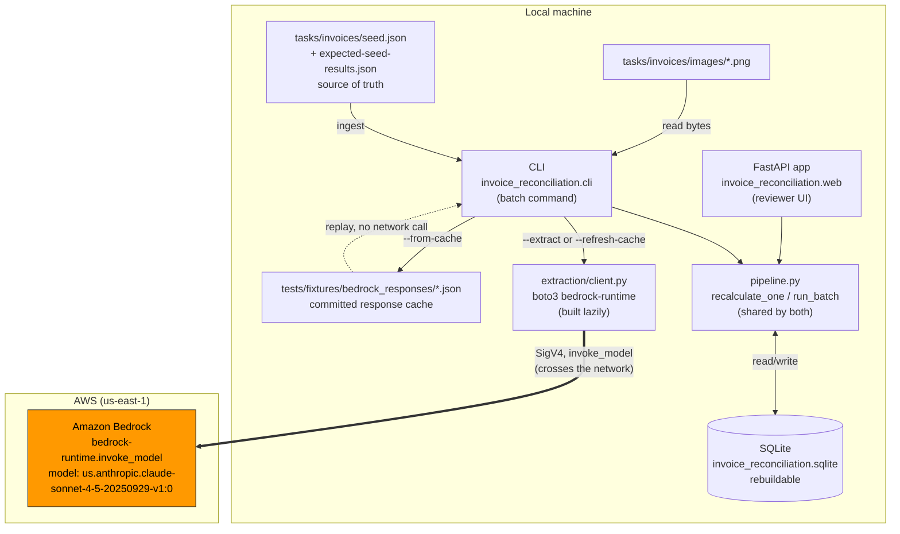
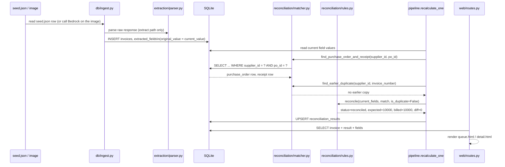
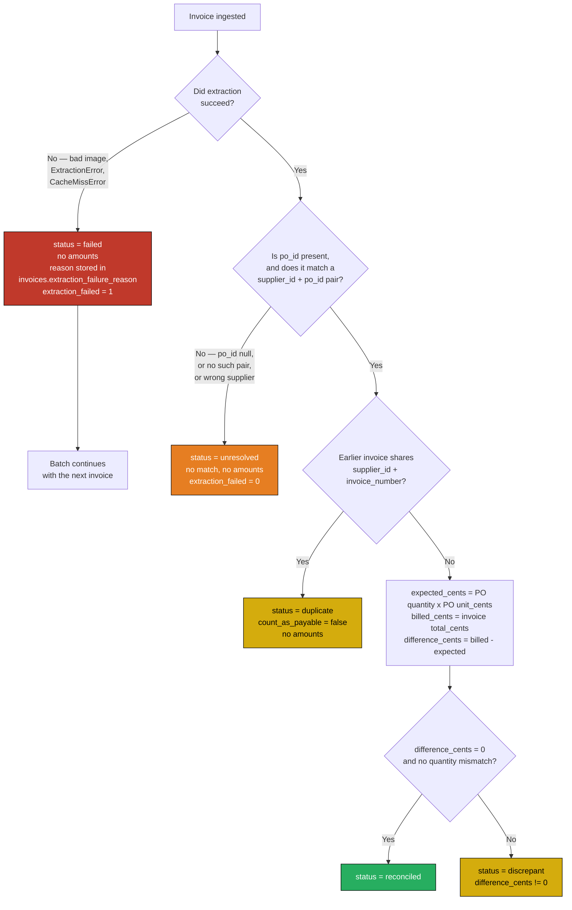
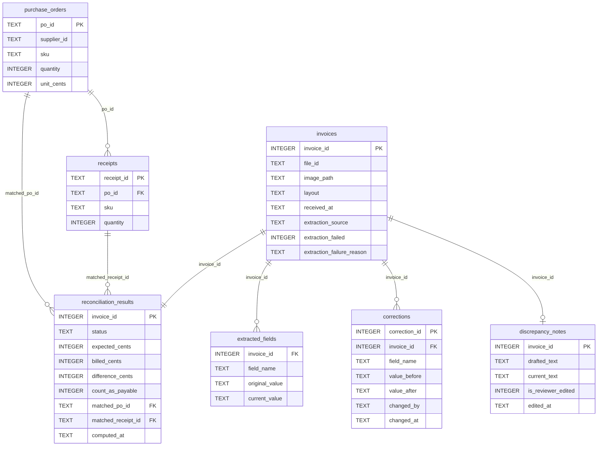

# Architecture

A visual guide to the invoice reconciliation system, for a confident demo.

## Does this use LangGraph? Checkpointers? An agent framework?

No. This project uses no LangGraph, no LangChain, and no agent framework.
There are no checkpointers.

The pipeline is a plain Python function (`pipeline.recalculate_one` and
`pipeline.run_batch`). Durable state lives in SQLite tables, not in a
framework's run state.

Why no framework: the flow is linear. Extract, match, compute, store. There
is no branching agent decision and no multi-step plan to track. A graph
runtime would add a dependency without removing any work. This is a design
choice, made for a reason, not an oversight.

## System architecture

One external service: Amazon Bedrock. Everything else runs on the local
machine.



Only one arrow crosses the network boundary: `extraction/client.py` calling
Bedrock. The cache-replay path (`--from-cache`) stays entirely local and
touches no AWS service. The web view never calls Bedrock directly — it
only reads and writes SQLite through the same `pipeline` module the CLI
uses.

## AWS services used

Exactly one AWS service: **Amazon Bedrock**.

| Detail | Value |
|---|---|
| Service | Amazon Bedrock, classic `bedrock-runtime` |
| Call | `invoke_model` |
| Region | `us-east-1` |
| Model ID | `us.anthropic.claude-sonnet-4-5-20250929-v1:0` (an inference profile — the `us.` prefix is required) |
| Auth | SigV4 from the standard AWS credential chain. No API key. |

Two things worth recording, because they were measured on this account,
not assumed:

- `AnthropicBedrockMantle` (the `bedrock-mantle...api.aws` endpoint) returns
  404 for every model tried here. It is a separate AWS service with a
  separate entitlement this account does not have. Classic
  `bedrock-runtime` works with the same credentials, region, and model ID.
- Credentials are needed only for live extraction. `--from-cache` replays
  committed responses and touches no AWS service at all. `boto3` is
  imported lazily inside `extraction/client.py:build_client`, for exactly
  this reason — importing the module never requires AWS credentials to be
  present.

No other AWS service is used. No S3, no Lambda, no API Gateway, no
DynamoDB, no cloud deployment of any kind. The database is a local SQLite
file; the fixtures are local JSON and PNG files; the cache is a local
directory of JSON files.

## Successful invoice flow

Image in, reconciliation result and UI view out. Worked example below: the
`clean` invoice, run through the seeded path (`uv run python -m
invoice_reconciliation.cli --reset-db --seed-check`).



Measured result for `clean`:

```
[clean] status=reconciled expected=$100.00 billed=$100.00 difference=$0.00
```

## The two failure paths — and why they look alike but are not

This distinction is the one that was a real defect once. A failed
extraction and an unresolved invoice can leave the same-looking
`extracted_fields` (empty, or `po_id` null). The thing that tells them
apart is `invoices.extraction_failed` — a stored flag, not a guess from
the field values.



The two failure paths, stated plainly:

- **Failed extraction.** The model call did not produce usable data at
  all — a missing image file, an `ExtractionError`, or (on replay) a
  `CacheMissError`. `invoices.extraction_failed` is set to `1`, with a
  stored reason. `reconciliation_results.status = 'failed'`, with no
  amounts. The batch continues to the next invoice.
- **Unresolved.** Extraction succeeded — the model read the invoice fine —
  but there is no usable purchase-order reference: `po_id` is null, or
  does not match any `(supplier_id, po_id)` pair, or belongs to a
  different supplier. `invoices.extraction_failed` stays `0`.
  `reconciliation_results.status = 'unresolved'`, also with no amounts.
  No match, so no expected or billed figure can be computed.

Both show up looking similar in `extracted_fields` — that is exactly why
the stored flag, not the field content, decides which status applies.

Measured result for the seeded `missing-reference` invoice (which has a
null `po_id` — extraction "succeeded" in the sense that the seed path
never calls a model, but the same unresolved rule applies to a live
extraction that reads no PO reference from the image):

```
[missing-reference] status=unresolved expected=- billed=- difference=-
```

**Discrepant**, for contrast — matched, computed, and the difference is
not zero. Measured result for `wrong-price` (billed a higher unit price
than the matched PO agreed):

```
[wrong-price] status=discrepant expected=$100.00 billed=$120.00 difference=$20.00
```

## The data model

Seven tables. Two are reference data supplied once; the rest describe one
invoice's journey through the pipeline.



What each table holds, and who writes it:

| Table | Holds | Durable or rebuildable | Written by |
|---|---|---|---|
| `purchase_orders` | Reference data: agreed supplier, SKU, quantity, unit price | Rebuildable — reloaded from `seed.json` on every `ingest_reference_data` call | `db/ingest.py:ingest_reference_data` |
| `receipts` | Reference data: quantity actually received against a PO | Rebuildable — same source | `db/ingest.py:ingest_reference_data` |
| `invoices` | One row per source document: file id, image path, layout, received time, extraction source, and the failure flag/reason | Durable per run, but rebuilt wholesale on re-ingest | `db/ingest.py` (`ingest_invoices` or `ingest_invoices_via_extraction`) |
| `extracted_fields` | The seven extracted values as TEXT, **twice**: `original_value` (what extraction first produced, never touched again) and `current_value` (what reconciliation reads now) | Durable — this is where a reviewer correction actually lives | Inserted by `db/ingest.py`; `current_value` updated by `web/routes.py:correct_field` |
| `corrections` | Append-only audit trail: every field change, before and after, who, when | Durable, append-only, never edited or deleted | `web/routes.py:correct_field` only |
| `reconciliation_results` | The computed outcome: status, expected/billed/difference cents, duplicate flag, matched PO and receipt ids | Durable, but **overwritten** on each recompute — one row per invoice, not a history | `pipeline.recalculate_one`, called by both the CLI batch and the correction route |
| `discrepancy_notes` | The drafted note text and the reviewer's current (possibly edited) text, plus an edited flag | Durable | Drafted by `web/routes.py:_ensure_discrepancy_note`; edited text saved by `web/routes.py:save_note` |

Why `extracted_fields` keeps `original_value` and `current_value` side by
side, in the same row, rather than one current value plus a separate
history table: reconciliation always needs the current value, and keeping
it as a plain column means every read is a flat `SELECT` — no "find the
latest row for this field" query. The full change history still exists;
it just lives in `corrections`, not in `extracted_fields` itself.

The database file itself (`invoice_reconciliation.sqlite`) is a
**rebuildable artifact** — `db/schema.py`'s own docstring says so
directly. The two sources of truth are `tasks/invoices/seed.json` (and
`expected-seed-results.json`, the oracle) and the committed response
cache under `tests/fixtures/bedrock_responses/`. Delete the `.sqlite`
file and `--reset-db` rebuilds it identically from those files.

**There is no in-memory session state and no server-side cache.** Every
route in `web/routes.py` opens its own short-lived SQLite connection,
reads or writes, and closes it before returning. A correction survives a
server restart because it was written to disk inside that one request —
there is nothing else holding it. This is also why the web view and the
CLI batch command never disagree: they are reading and writing the exact
same file, through the exact same `pipeline` functions.

## Endpoints

All six routes, from `web/routes.py`. Quoted decorators below are the
actual code.

| Method & path | Decorator | Reads | Writes | Recalculates? |
|---|---|---|---|---|
| `GET /invoices` | `@router.get("/invoices", response_class=HTMLResponse)` | `reconciliation_results` joined to `invoices`, optionally filtered by `?status=` | Nothing | No |
| `GET /invoices/{invoice_id}` | `@router.get("/invoices/{invoice_id}", response_class=HTMLResponse)` | `invoices`, `extracted_fields` (original and current), `reconciliation_results`, matched `purchase_orders`/`receipts`, `discrepancy_notes` | May insert a first-time drafted note (`discrepancy_notes`) if this invoice is discrepant and has never been viewed before | No — drafting a note on first view does not touch `reconciliation_results` |
| `GET /invoices/{invoice_id}/image` | `@router.get("/invoices/{invoice_id}/image")` | `invoices.image_path`, then the file on disk (path-escape checked against `tasks/invoices/images`) | Nothing | No |
| `POST /invoices/{invoice_id}/fields/{field_name}` | `@router.post("/invoices/{invoice_id}/fields/{field_name}")` | Current field value, to validate and log the change | `corrections` (audit row), `extracted_fields.current_value`, then `reconciliation_results` (via `recalculate_one`), then re-drafts the discrepancy note | **Yes** — this is the one route that calls `pipeline.recalculate_one` |
| `POST /invoices/{invoice_id}/note` | `@router.post("/invoices/{invoice_id}/note")` | Existing note row (404 if none) | `discrepancy_notes.current_text`, `is_reviewer_edited`, `edited_at` | **No** — deliberately. Editing a note is commentary on an already-computed result, not an input to one |
| `GET /summary` | `@router.get("/summary", response_class=HTMLResponse)` | Status counts, the recoverable total (`SUM(difference_cents)` for discrepant invoices only), and the list of discrepant invoices with their differences | Nothing | No |

Note the note editor by name: `save_note` never calls
`pipeline.recalculate_one` and never touches `reconciliation_results` or
`extracted_fields`. And there is no send control anywhere in this
product — no route emails, submits, or transmits anything to a supplier.
Every route either shows stored state or lets a reviewer correct a field
or a note; nothing here sends.

## The CLI

Entry point: `uv run python -m invoice_reconciliation.cli [flags]`.

Real flags, quoted from `--help`:

```
options:
  -h, --help            show this help message and exit
  --extract             Read invoice field values from each image via a live
                        Bedrock call, instead of the prepared seed values.
                        Needs AWS credentials. Default: off.
  --from-cache          Run extraction from saved responses. No credentials
                        needed.
  --refresh-cache       Force live calls and overwrite the saved responses.
  --seed-check          After persisting, compare results with expected-seed-
                        results.json.
  --reset-db            Drop and rebuild the database before ingest.
  --ingest-dir INGEST_DIR
                        Source directory. Default tasks/invoices/.
  --db-path DB_PATH     Database location. Default
                        invoice_reconciliation.sqlite.
  --log-level {DEBUG,INFO,WARNING,ERROR,CRITICAL}
                        Logging verbosity. Default WARNING.
```

`--extract` and `--from-cache`/`--refresh-cache` all select the live
extraction ingest path instead of the prepared-record (seeded) path.
`--from-cache` and `--refresh-cache` are mutually exclusive — passing both
is a parser error.

### Exit codes

Two signals are kept separate on purpose: whether any invoice failed to
process, and whether the seed comparison matched the oracle. They are
different problems — "the model failed" versus "the rules are wrong" —
and are never merged into one number.

| Code | Meaning |
|---|---|
| 0 | Success. Every invoice processed without a `failed` status, and (if `--seed-check` was passed) the comparison matched the oracle exactly. |
| 1 | The seed comparison failed, and no invoice had status `failed`, and the batch did not crash. A rules/data problem, not a processing crash. |
| 2 | At least one invoice has status `failed`, or the batch itself raised an unhandled exception before finishing. A processing problem, regardless of whether `--seed-check` was requested. |
| 3 | Both at once: at least one invoice failed, and (if requested) the seed comparison also failed. |

Measured run (`uv run python -m invoice_reconciliation.cli --reset-db
--seed-check`, against a scratch database):

```
Processed 6 invoice(s):
  [clean] status=reconciled expected=$100.00 billed=$100.00 difference=$0.00
  [wrong-price] status=discrepant expected=$100.00 billed=$120.00 difference=$20.00
  [duplicate] status=duplicate expected=- billed=- difference=- count_as_payable=False
  [missing-reference] status=unresolved expected=- billed=- difference=-
  [quantity-overbill] status=discrepant expected=$100.00 billed=$160.00 difference=$60.00
  [undercharge] status=discrepant expected=$100.00 billed=$90.00 difference=-$10.00
Processing: all invoices processed (no 'failed' status).

Seed check results:
  [PASS] clean: OK (reconciled)
  [PASS] wrong-price: OK (discrepant)
  [PASS] duplicate: OK (duplicate)
  [PASS] missing-reference: OK (unresolved)
Seed comparison: PASSED — all cases match the oracle exactly.
```

This run exited 0: six invoices processed, none `failed`, and all four
oracle-checked cases passed.
